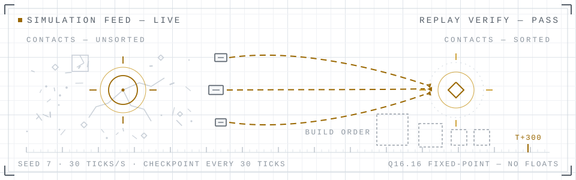

<div align="center">

# Pandemonium: Build & Destroy

**A deterministic real-time strategy foundation, written from scratch in Rust.**
No game engine, no ECS framework, no off-the-shelf simulation — the loop, the
entity store, the fixed-point math, the replay codec: all of it is ours.

The name promises chaos. The simulation declines to deliver it. A match is a
seed, a content hash, and an ordered command log — replay it anywhere and every
checksum must match, tick for tick. Units may scatter. The simulation does not.

[](https://github.com/E-Vex/pandemonium-bd/actions/workflows/ci.yml)


<picture>
  <source media="(prefers-color-scheme: dark)" srcset="assets/hero-dark.svg">
  
</picture>

</div>

---

## What is Pandemonium

Pandemonium is not yet a game — it is the foundation a game grows from. The
repository holds a nine-crate Rust workspace implementing a deterministic
fixed-tick simulation (30 ticks per second), an intent-only command interface, a
checksummed replay codec, and the developer tooling to prove all three. The
content pipeline, the windowed client, and the AI opponent are specified and
scheduled, and are built in that order. Nothing here is aspirational hand-waving:
the operating contract says "prove, don't assert," and the technical claims on
this page are backed by tests that exist in the repository.

"Own engine" is meant literally. We write the game loop and timing, the
entity and capability stores, the simulation core, the fixed-point math library,
the deterministic RNG, pathfinding and steering, the command and replay systems,
the content loader and validators, the renderer abstraction, the camera, the
input mapping, and the UI toolkit. Only low-level crates for OS and GPU access
(winit, wgpu) are used at the edges. Game engines, ECS frameworks, physics and
pathfinding crates, and the `rand` ecosystem are not merely avoided — they are
forbidden by name, and adding one fails the build.

The design rests on four blocks, chosen so that everything later grows through
them instead of around them:

- **The simulation loop** — a fixed 30 Hz tick that is the only way state advances.
- **The entity model** — one base record plus composable capabilities, 64-bit IDs
  that are never reused, systems that iterate by capability rather than by name.
- **The command system** — every player, AI, and replay action enters as a
  validated `Command` applied at a tick boundary, through one shared gate.
- **The data boundary** — stats, costs, maps, and factions are versioned data
  files; tick order and command semantics are code, and never vary per item.

## Why this exists

The governing question (plan §1): *are we building a game, or a foundation that
can become a much larger game?* The second. Early Minecraft had few features,
but its block abstraction absorbed years of growth; Pandemonium's equivalent
abstractions are the four blocks above. The long arc — new units, new armies,
new maps, new mechanics, better AI, expanded multiplayer — only stays cheap if
each arrow passes through the architecture instead of fighting it.

Rigor is spent where change is expensive: the simulation, the commands, entity
identity, and the data boundary. Visuals, UI layout, and balance numbers stay
deliberately lightweight — placeholder art is policy, not poverty. The Alpha is
explicitly *not* judged on unit count, graphics, campaign, online features, or
balance depth; a proposal that mostly improves those is out of scope by rule,
not by mood.

## Frozen decisions

Ten foundational decisions are frozen (plan §2). Changing one requires a written
ADR with evidence in `docs/adr/` — never a silent edit. Together they are the
difference between "deterministic" as a buzzword and determinism as a property
you can test.

| | Decision | Consequence |
|---|---|---|
| **FD-1** | Deterministic fixed-tick simulation, 30 ticks/s, decoupled from rendering | A match = seed + content hash + ordered command log; replays, soak tests, and lockstep follow |
| **FD-2** | All intent enters as validated `Command` records at tick boundaries | Only the tick function may mutate simulation state |
| **FD-3** | Unified entity model: base record + composable capabilities; monotonic 64-bit IDs | New entity types are data; systems iterate by capability |
| **FD-4** | Strict data/code boundary; versioned, validated content files | Add-a-unit and add-a-map require zero engine changes |
| **FD-5** | No floating point in the simulation or in content | Bit-identical results across OS, CPU, and compiler |
| **FD-6** | The simulation depends on nothing above it — no renderer, clock, or I/O | The renderer and UI can be replaced without touching rules |
| **FD-7** | The AI plays through commands and a fog-filtered view, like everyone else | Parity is structural — cheating is a compile error, not a policy |
| **FD-8** | Fog filters information; it never alters the simulation | Replays and AI stay honest; hidden entities behave identically |
| **FD-9** | Events flow outward; presentation never polls simulation internals | The feedback layer grows without simulation changes |
| **FD-10** | Content schema only moves forward | Content survives years of growth |

Determinism is enforced mechanically, not ceremonially: no floating-point types,
no unordered maps in state or state-affecting iteration, no wall-clock reads, no
OS entropy, no pointer-width values in hashed state — each banned by clippy
lints *and* a line-by-line source scan that runs with the test suite. Randomness
is allowed, but it is seeded, owned by the simulation, and advanced in a fixed
order. No entropy without paperwork.

## Architecture

Dependencies point downward only. This is not a convention enforced by review —
`tests/architecture_law.rs` parses every member manifest on every test run,
checks the internal edge allow-list and the per-crate external allow-list, fails
on the forbidden-crate list, and scans the determinism crates' sources for
banned types. Breaking the architecture is a build failure, not a conversation.

<picture>
  <source media="(prefers-color-scheme: dark)" srcset="assets/architecture-dark.svg">
  
</picture>

The shape the whole design hangs on is FD-2: `Sim::step(commands)` is the only
mutator of simulation state, and the simulation knows nothing above itself.
Everything the outside world learns — snapshots, events, fog-filtered
`PlayerView`s — flows out through typed boundaries. The client never touches the
simulation directly; it submits commands and renders snapshots. Because every
issuer goes through the same gate, the player, the AI, and a replay share one
code path by construction — and so would a future network peer.

### The shape of time

The simulation is a clock, not a frame counter. It advances at exactly 30 Hz;
rendering runs at display rate and interpolates between the previous and current
snapshots. Time originates in the engine and the client — never inside the
simulation.

<picture>
  <source media="(prefers-color-scheme: dark)" srcset="assets/timestep-dark.svg">
  
</picture>

### Inside a tick

The fixed update order inside `step()` never varies per content item (plan §6.3).
At M1 the spine stages are live and the systems stages are documented no-ops
waiting for their milestones — the status is deliberate, not hidden:

| # | Stage | State at M1 |
|---|---|---|
| 1 | Apply commands — sort by (issuer, seq), validate, apply or reject | **live** |
| 2 | Orders — resolve current orders into system intents | reserved (M4–M5) |
| 3 | Production & construction — queues, progress, spawns | stand-in: scheduled spawns |
| 4 | Economy — gathering, delivery, storage, spending | reserved (M5) |
| 5 | Target acquisition | reserved (M6) |
| 6 | Movement — path requests, steering, collision | placeholder straight-line mover ([DEBT-003](docs/DEBT.md)) |
| 7 | Combat — the fixed resolution pipeline | reserved (M6) |
| 8 | Death & cleanup — health advance, lifecycle events, removal | **live** |
| 9 | Vision — per-player visibility | on-demand fog filter ([DEBT-004](docs/DEBT.md)) |
| 10 | Match rules — defeat and victory evaluation | reserved (M8) |
| 11 | Finalize — tick++, flush events, periodic hash every 30 ticks | **live** |

## Current status

**Milestone M0 (skeleton & guardrails) and M1 (simulation core) are complete.
M2 (content pipeline) is next.** The live status board is
[`AI-Handoff.md`](AI-Handoff.md); an out-of-date handoff is treated as a bug.

Built and verified at M1:

- **`fx`** — Q16.16 fixed-point math with 64-bit intermediates, round-toward-zero
  and saturating contracts (identical in debug and release), exact integer square
  root over the full u64 range, PCG32 RNG with canonical seeding, FNV-1a 64-bit
  hashing — all property-tested.
- **`sim`** — the tick pipeline above; entity and capability stores kept in
  ascending-ID order by construction; the shared command gate covering all ten
  command kinds with rejection events and zero state change on refusal; canonical
  little-endian state hash; snapshots and fog-filtered player views.
- **`replay`** — a checksummed canonical little-endian codec (record, load,
  validate) with typed errors. No serde: the dependency law forbids it here.
- **`tools`** — a headless runner for scripted matches and `replay-verify`, which
  re-simulates a replay and compares every checkpoint hash (acceptance A2).
- **`tests/`** — determinism acceptance A1/A2 with pinned golden hashes, plus
  proofs that IDs are never reused, iteration order is strictly ascending,
  invalid commands change no state, and the dependency law holds (A13).
- **CI** — fmt, clippy with `-D warnings`, and the test suite in dev *and*
  release on Linux, Windows, and macOS, plus the replay round-trip and a
  binaries-run check. 113 tests green, dev and release identical.

Not built yet — on purpose, in milestone order:

- No window or renderer: the client binary prints a placeholder banner until M3.
- No content loading: `content/` is an empty tree until M2; the simulation
  currently runs against a documented in-code fixture.
- No pathfinding, combat, economy, or AI: the mover is an acknowledged placeholder
  (DEBT-003), and the systems land with M4–M7.
- No multiplayer: the hooks are designed in (`Command.tick`, hashed checkpoints
  for desync detection), the netcode is not.

## Repository structure

```text
pandemonium-bd/
├─ crates/
│  ├─ fx/         fixed-point math (Fx, Vec2Fx, isqrt), PCG32 RNG, FNV-1a hasher
│  ├─ sim_api/    boundary vocabulary: Command, Event, Snapshot, PlayerView, Reject
│  ├─ sim/        the simulation: tick pipeline, stores, command gate, state hash
│  ├─ content/    RON schema, versioned loaders, validators        (M2)
│  ├─ ai/         controllers that play through commands           (M7)
│  ├─ replay/     checksummed replay codec: record, load, verify
│  ├─ engine/     game loop, interpolation, input mapping, UI kit  (M3)
│  ├─ client/     the playable binary: wgpu + winit                (M3)
│  └─ tools/      headless runner, replay verifier (soak, bench: M7/M10)
├─ tests/         cross-crate acceptance tests (A1–A15)
├─ content/       data-only game content: entities, factions, maps, rules (lands in M2)
├─ docs/          ARCHITECTURE · DEBT · ASSUMPTIONS · CONTENT_GUIDE · adr/
├─ plan.md        the authoritative specification (v2.0)
└─ AI-Handoff.md  live status board and resume protocol
```

## Quick start

The toolchain is pinned to an exact Rust version in
[`rust-toolchain.toml`](rust-toolchain.toml); rustup installs it automatically on
first use.

```bash
# run the scripted demo match headlessly — prints every checkpoint and the final hash
cargo run -p pandemonium-tools -- headless --seed 7 --ticks 300

# record a replay, then re-simulate it and compare every checkpoint
cargo run -p pandemonium-tools -- headless --seed 7 --ticks 300 --record demo.pdrp
cargo run -p pandemonium-tools -- replay-verify demo.pdrp

# the client binary (placeholder banner until the windowed client lands in M3)
cargo run -p pandemonium-client
```

The full verification gate — the same one CI runs:

```bash
cargo fmt --all -- --check
cargo clippy --workspace --all-targets -- -D warnings
cargo test --workspace             # dev profile
cargo test --workspace --release   # determinism must hold in release too
```

Same seed, same ticks — same hashes, on any machine, in either profile. If those
hashes ever differ between two runs, that is not a feature. File it.

## Development workflow

Every change passes the green gate before commit: formatting, clippy with zero
tolerance, and the full test suite in both profiles. One logical change per
commit. Milestones are never skipped, and M(N+1) does not start until every exit
test of M(N) is green in CI. Deliberate simplifications are logged in
[`docs/DEBT.md`](docs/DEBT.md) with a repayment trigger; guessed decisions are
logged in [`docs/ASSUMPTIONS.md`](docs/ASSUMPTIONS.md); challenges to frozen
decisions go through an ADR in `docs/adr/`.

The process is strict because the product is trust. A deterministic engine is a
promise, and promises are kept by boring discipline — the operating contract in
[plan.md §0](plan.md) is short, and worth reading before the first commit.

## Documentation

| Document | Role |
|---|---|
| [`plan.md`](plan.md) | the authoritative specification: frozen decisions, determinism rules, milestones M0–M10, acceptance criteria A1–A15 |
| [`AI-Handoff.md`](AI-Handoff.md) | live status board, verification commands, and hard-won gotchas — start here to pick up development |
| [`docs/ARCHITECTURE.md`](docs/ARCHITECTURE.md) | the working map of the code as built |
| [`docs/DEBT.md`](docs/DEBT.md) | every deliberate simplification, each with a repayment trigger |
| [`docs/ASSUMPTIONS.md`](docs/ASSUMPTIONS.md) | every interpretation that had to be guessed, numbered and cited |
| [`docs/CONTENT_GUIDE.md`](docs/CONTENT_GUIDE.md) | content authoring reference (expands in M2; plan §10 governs meanwhile) |
| [`docs/adr/`](docs/adr/README.md) | the process for proposing changes to frozen decisions |

## Roadmap

Milestones are gates, not dates — the calendar (~26 weeks for a small human team)
is a reference, the exit criteria are the truth. Each prototype gate P1–P5 asks
one question and refuses to move on until it is answered.

| Milestone | Delivers | Exit gate |
|---|---|---|
| **M2** — Content pipeline | RON schemas, versioned loaders, validators, map loader, content hash, `content-validate` tool | all Alpha content loads from data; the add-a-unit scaffold proves the boundary |
| **M3** — Engine shell | window, wgpu 2D renderer, camera, snapshot interpolation, fixed loop, input → commands, minimal HUD | a windowed build shows a live simulation; Move commands work |
| **M4** — Movement *(P1: do multiple units move responsibly?)* | nav grid, deterministic A*, path execution, collision, stuck detection | 50 units respond within 2 ticks under spam-clicked orders; nobody is permanently stuck |
| **M5** — Economy & production *(P3: do openings diverge?)* | resource registry, gather loop, queues, construction, population, requirements | scripted openings produce measurably different timelines |
| **M6** — Combat & vision *(P2: is combat legible and meaningful?)* | combat pipeline, targeting, three-state fog, turrets, event cues | composition and position matter; fog integrity proven |
| **M7** — AI through commands *(P4: is parity real?)* | `Controller` trait, scripted opponent, parity audit | AI-vs-AI headless matches complete; parity is compile-time |
| **M8** — Match rules *(P5: do all systems work together?)* | victory, defeat, resignation, end screen, restart, UI depth | a 10–15 minute match versus the AI completes and restarts cleanly |
| **M9** — Alpha content & feel | manifest tuning, feedback pass, placeholder audio | the minimum viable loop is playable end-to-end |
| **M10** — Stabilization & declaration | full acceptance suite A1–A15, nightly soak, benchmark baselines | every criterion verified with evidence, in writing |

Beyond the Alpha, the expansion sequence is already audited against the
architecture: new unit, new building, new map, stat rebalance, second faction —
all data-only — then abilities, tech tree, and evaluative AI above the command
interface. Multiplayer rides on hooks that exist from day one: `Command.tick` is
the input-delay field for lockstep, and hashed checkpoints are the desync alarm.
The Alpha is declared only when every criterion is verified; one that cannot be
met honestly is recorded as a finding, never waved through.

## Contributing

Contributions follow the same law as the code. Read
[plan.md §0](plan.md) (the operating contract) and
[`AI-Handoff.md`](AI-Handoff.md) first, then work within a milestone: one logical
change per commit, the green gate before every commit, and automated proof for
any claim the code makes. Simplifications go to the debt register; guesses go to
the assumptions log; frozen decisions change only through an ADR.

Gameplay content is not accepted yet — the content pipeline is M2, and content
is data, so the door opens when the data boundary exists. Bug reports, however,
are welcome now, and this project makes them unusually actionable: a report that
includes the seed and the tick is a reproducible incident. Anything else is a war
story.

## License

No license has been published yet. Without a LICENSE file, standard copyright
defaults apply: you are welcome to read, study, and link to the code, but formal
reuse and redistribution terms have not been granted. This section will be
updated the moment that changes.

---

<div align="center">

<picture>
  <source media="(prefers-color-scheme: dark)" srcset="assets/seal-dark.svg">
  
</picture>

**Pandemonium: Build & Destroy** — by [E-Vex](https://github.com/E-Vex)

*Determinism under fire.*

</div>
