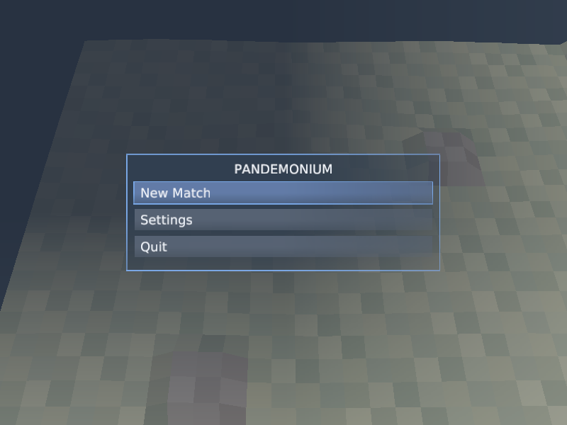
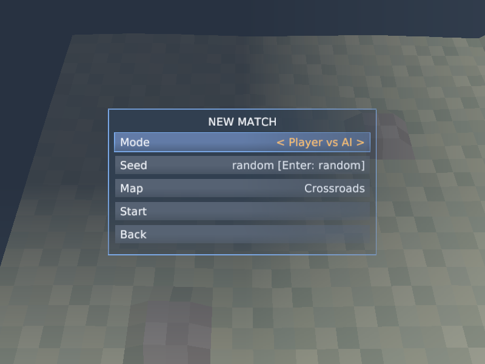
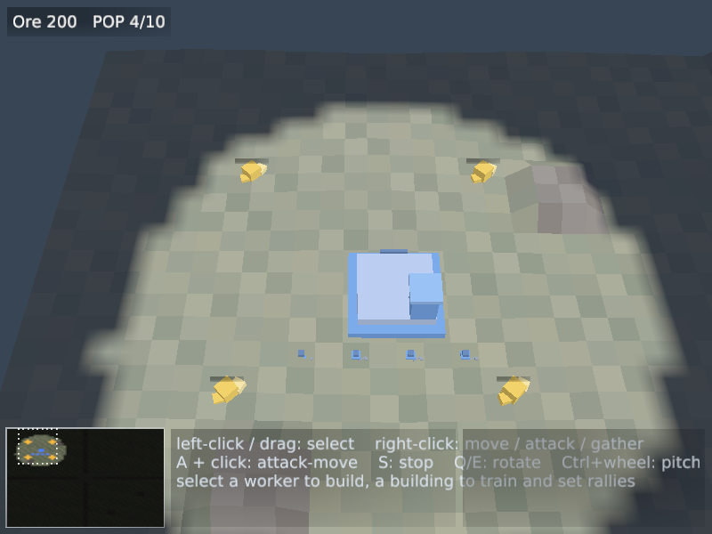
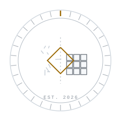

<div align="center">

# Pandemonium: Build & Destroy

**A deterministic real-time strategy foundation, written from scratch in Rust.**
No game engine, no ECS framework, no off-the-shelf simulation — the loop, the
entity store, the fixed-point math, the replay codec: all of it is ours.

The name promises chaos. The simulation declines to deliver it. A match is a
seed, a content hash, and an ordered command log — replay it anywhere and every
checksum must match, tick for tick. Units may scatter. The simulation does not.

[](https://github.com/E-Vex/pandemonium-bd/actions/workflows/ci.yml)

-9E6A03?labelColor=21262D)


<picture>
  <source media="(prefers-color-scheme: dark)" srcset="readme-assets/hero-dark.svg">
  
</picture>

</div>

---

## Status — accurate as of M10.2 (October 2026)

Milestones M0 through M10.2 are complete and green: **553 tests pass in dev,
548 in release** (5 should-panic invariant tests are debug-only), on Linux,
Windows, and macOS in CI, with the three golden hashes bit-identical across
every change. The windowed client plays a full match against the scripted AI
opponent — menus, settings that persist, audio, fog, minimap, replays.

The Alpha is **not yet declared**: one acceptance criterion is open by design —
**A14, the human playtest** (five first-time tester slots, scheduled in
[`docs/PLAYTEST.md`](docs/PLAYTEST.md)). The Alpha's *system* properties are
declared proven with evidence in
[`docs/ALPHA_DECLARATION.md`](docs/ALPHA_DECLARATION.md); the playtest decides
the human half. The live status board is [`AI-Handoff.md`](AI-Handoff.md); an
out-of-date handoff is treated as a bug.

The product surface is being audited for the first release: the journey map and
R1 gap list live in
[`docs/product/GAP_ANALYSIS.md`](docs/product/GAP_ANALYSIS.md).

## What it looks like

Real captures from the client (Xvfb + software GL, `master` `23012bf`) — the
main menu, the match setup screen, and a match in progress with the HUD,
command card, and standing controls line:

<p align="center">



</p>

## Run it

The toolchain is pinned to an exact Rust version in
[`rust-toolchain.toml`](rust-toolchain.toml); rustup installs it automatically
on first use.

```bash
# the windowed client — opens at the main menu on a desktop
cargo run -p pandemonium-client

# windowed smoke: auto-exit after N frames with an evidence summary
cargo run -p pandemonium-client -- --frames 900

# no display? the client says so honestly and runs a headless smoke pass instead

# headless scripted match — prints every checkpoint hash and the final hash
cargo run -p pandemonium-tools -- headless --seed 7 --ticks 300   # 0xb6fff6659cfb7709

# record a replay, then re-simulate it and compare every checkpoint
cargo run -p pandemonium-tools -- headless --seed 7 --ticks 300 --record demo.pdrp
cargo run -p pandemonium-tools -- replay-verify demo.pdrp

# validate the content bundle (prints content hash + map id, exits 0 on PASS)
cargo run -p pandemonium-tools -- content-validate content
```

The main menu starts a match (**Player vs AI / AI vs AI spectate / Sandbox**),
keeps your seed and map choices within the run, and persists settings across
runs (`edge_scroll`, `pan_speed`, `zoom_min`, `zoom_max`, `master_volume`,
`muted`, `fullscreen`, `debug_overlay` — a small `key=value` file in your user
config directory; see `docs/product/GAP_ANALYSIS.md` §11 for the exact
per-OS locations). `--seed N` pre-fills the New Match screen's seed field;
without it the seed is random and shown, so you can still report it.

## Build it

```bash
cargo build --workspace               # debug
cargo build --workspace --release     # the profile benchmarks and soaks run in
```

The full verification gate — the same one CI runs on every push, on all three
OSes, in both profiles:

```bash
cargo fmt --all -- --check
cargo clippy --workspace --all-targets -- -D warnings
cargo test --workspace
cargo test --workspace --release   # determinism must hold in release too
```

Same seed, same ticks — same hashes, on any machine, in either profile. If
those hashes ever differ between two runs, that is not a feature. File it.

## Controls (Generals: Zero Hour muscle memory)

**Selecting** — **left-click** selects, **left-drag** box-selects; left never
issues an order, and a click on empty ground does nothing (Esc clears the
selection). **Shift+click** adds or removes one unit, **shift+drag** adds the
box's picks, **double-click** selects every visible unit of the same kind.

**Commanding** — **right-click** is the only way to command: on an enemy it
attacks, on an ore node it gathers (workers), on open ground it moves, and on
a single selected producer it sets the rally point. A click under 6 px of
travel orders; **right-drag** beyond that grabs and scrolls the map (the
release then orders nothing). **A** arms attack-move for the next left-click,
**S** stops.

**Camera** — **right-drag** scrolls, **middle-drag** rotates, **WASD /
arrows / screen edges** pan, **Q / E** rotate, the **wheel** zooms toward the
cursor, **Ctrl+wheel** tilts the pitch.

**Groups & jumps** — **1–9** recall control groups, **Ctrl+1–9** assigns,
double-tap centers on the group. **Space** jumps to the last death (or your
base). **Esc** climbs one rung per press: armed command → placement →
selection → **pause menu**. **P** pauses without the menu, **F3** toggles the
debug overlay, **F8** writes the bug-report dump, **R** restarts after the
match ends.

The tester-facing copy of this card (and the playtest protocol around it) is
[`docs/PLAYTEST.md`](docs/PLAYTEST.md).

## Architecture in five lines

1. `sim` advances the world in a fixed 30 Hz tick — `Sim::step(commands)` is the
   **only** mutator, and the simulation depends on nothing above it (FD-2/FD-6).
2. All intent — player, AI, replay, future network — enters as validated
   `Command` records through one gate (FD-2/FD-7); parity is a compile error, not
   a policy.
3. `content` turns strict, versioned RON data into plain structs; units, maps,
   and factions are data, and adding one touches no engine code (FD-4/FD-10).
4. `engine` hosts matches (`MatchHost`), interpolates snapshots, and defines the
   renderer/audio seams; `client` is one swappable presentation above it all.
5. No floating point, no unordered maps, no wall-clock, no OS entropy anywhere
   in the simulation — enforced by lints *and* a source-scanning test (FD-5).

Dependencies point downward only, and
[`tests/architecture_law.rs`](tests/architecture_law.rs) makes breaking that a
build failure, not a conversation. The full specification is
[`plan.md`](plan.md); the code-as-built map is
[`docs/ARCHITECTURE.md`](docs/ARCHITECTURE.md).

## Repository structure

```text
pandemonium-bd/
├─ crates/
│  ├─ fx/         fixed-point math (Fx, Vec2Fx, isqrt), PCG32 RNG, xxHash64 hasher
│  ├─ sim_api/    boundary vocabulary: Command, Event, Snapshot, PlayerView, Reject
│  ├─ sim/        the simulation: 11-stage tick pipeline, stores, command gate, state hash
│  ├─ content/    RON schema, versioned loaders, validators, ContentBundle
│  ├─ ai/         the scripted Alpha opponent (Controller trait, commands-only)
│  ├─ replay/     checksummed replay codec: record, load, verify
│  ├─ engine/     game loop, interpolation, MatchHost, camera, mesh, renderer + audio seams
│  ├─ client/     the playable binary: wgpu + winit, 3D renderer, HUD, menus, audio
│  └─ tools/      headless runner, replay verifier, content validator, soak, bench
├─ tests/         cross-crate acceptance tests (A1–A15)
├─ content/       data-only game content: rules, entities, factions, maps
├─ docs/          ARCHITECTURE · DEBT · ASSUMPTIONS · product/ · adr/ · …
├─ plan.md        the authoritative specification (v2.0)
└─ AI-Handoff.md  live status board and resume protocol — start here
```

## Documentation

| Document | Role |
|---|---|
| [`AI-Handoff.md`](AI-Handoff.md) | **start here** — live status board, verification commands, hard-won gotchas |
| [`plan.md`](plan.md) | the authoritative spec: frozen decisions FD-1..10, determinism rules, milestones, acceptance A1–A15 |
| [`docs/product/GAP_ANALYSIS.md`](docs/product/GAP_ANALYSIS.md) | the product-surface audit: the player journey vs the shipped client, and the ordered R1 gap list |
| [`docs/ALPHA_DECLARATION.md`](docs/ALPHA_DECLARATION.md) | the acceptance sweep A1–A15 with evidence; A14's open finding |
| [`docs/PLAYTEST.md`](docs/PLAYTEST.md) | the A14 instrument: protocol, controls card, tester schedule and results |
| [`docs/ARCHITECTURE.md`](docs/ARCHITECTURE.md) | the working map of the code as built |
| [`docs/DEBT.md`](docs/DEBT.md) | every deliberate simplification, each with a repayment trigger |
| [`docs/ASSUMPTIONS.md`](docs/ASSUMPTIONS.md) | every interpretation that had to be guessed, numbered and cited |
| [`docs/CONTENT_GUIDE.md`](docs/CONTENT_GUIDE.md) | content authoring reference |
| [`docs/adr/`](docs/adr/README.md) | the process for changing frozen decisions (ADR-0001 3D presentation, ADR-0002 audio backend, ADR-0100 app shell — proposed) |
| [`CHANGELOG.md`](CHANGELOG.md) | one entry per milestone |
| [`SECURITY.md`](SECURITY.md) | the declared threat model |

## Bug reports are reproducible incidents

A report that includes the seed and the tick is a reproducible incident;
anything else is a war story. The windowed client writes the report for you:
press **F8** at (or right after) the moment of the problem and it drops a replay
record (`pandemonium-report-<seed>-tick<tick>.pdrp`) plus a sidecar `…-info.txt`
carrying the seed, the tick, and the content identity — attach both files to
the issue; the replay re-verifies headlessly
(`cargo run -p pandemonium-tools -- replay-verify <file>`).

## Development workflow

Every change passes the green gate before commit (formatting, clippy with zero
tolerance, the full suite in both profiles). One logical change per commit.
Milestones are gates, not dates: M(N+1) does not start until every exit test of
M(N) is green in CI. Deliberate simplifications go to
[`docs/DEBT.md`](docs/DEBT.md) with a repayment trigger; guessed interpretations
go to [`docs/ASSUMPTIONS.md`](docs/ASSUMPTIONS.md); challenges to frozen
decisions go through an ADR. Read [plan.md §0](plan.md) (the operating
contract) before the first commit — the process is strict because the product
is trust.

Contributions follow the same law as the code. Gameplay content is not
accepted while the Alpha content manifest is locked; bug reports (with seed and
tick) are welcome now and unusually actionable.

## License

To be decided by the owner.

---

<div align="center">

<picture>
  <source media="(prefers-color-scheme: dark)" srcset="readme-assets/seal-dark.svg">
  
</picture>

**Pandemonium: Build & Destroy** — by [E-Vex](https://github.com/E-Vex)

*Determinism under fire.*

</div>
